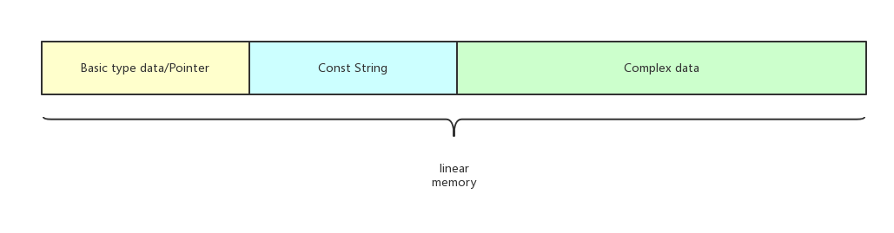

Ontology wasm
=====
## Introduction
Ontology wasm is a VM for ontology block chain, it can also be used for other stand-alone environment not only for block chains.

WebAssembly (abbreviated *Wasm*) is a binary instruction format for a stack-based virtual machine. Wasm is designed as a portable target for compilation of high-level languages like C/C++/Rust.


## Structure

Ontology-wasm disassemble and execute wasm binary codes based on [Wagon](https://github.com/go-interpreter/wagon) project with extra memory management. 

Currently, we support int, int64 float, double, string(byte array), int array and int64 array data types,

since wasm only has 4 types (i32,i64,f32 and f64), that means only the 4 types data could be pushed into the stack,any other complex data type must be stored in memory.

In  MVP version,every module can has only one linear memory




## Useage

1. create a Engine to contain the VM, example like below:

```go
type ExecutionEngine struct {
	service *InteropService
	vm      *VM
	version  string //for test different contracts
	backupVM *vmstack
}

func NewExecutionEngine(iservice IInteropService, ver string) *ExecutionEngine {

	engine := &ExecutionEngine{
		service: NewInteropService(),
		version: ver,
	}
	if iservice != nil {
		engine.service.MergeMap(iservice.GetServiceMap())
	}

	engine.backupVM = newStack(VM_STACK_DEPTH)
	return engine
}
```

**service** contains the system apis which exists in the "import 'env' " section, that means you can create any api calls implemented by golang code.

We already put same apis in ```env_service.go```

**ver** represent the version of engine, you can use this field to decide how to deserialize your parameters.

You can checkout the tests in ```exec/engine_test.go```